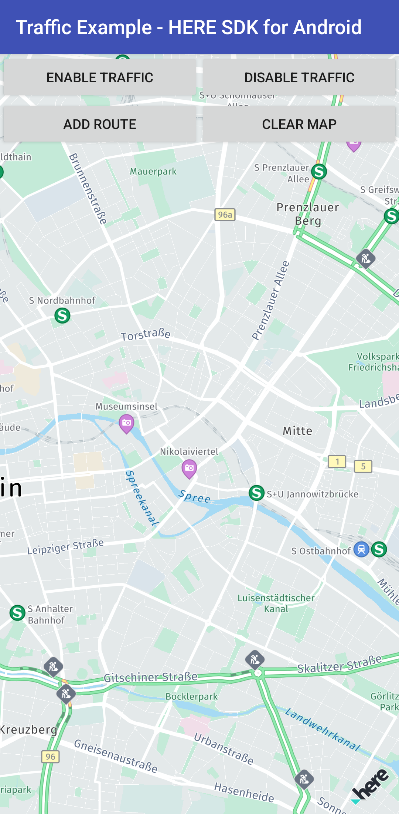

The Traffic example app shows how to toggle traffic flow and traffic incidents visualization on a map and how to use the TrafficEngine to query such data in realtime, for example, along a route. You can find how this is done in [TrafficExample.java](app/src/main/java/com/here/traffic/TrafficExample.java) and [RoutingExample.java](app/src/main/java/com/here/traffic/RoutingExample.java).



This example uses **HERE SDK Units** to support functionality such as permission handling or buttons that are not essential to the code snippets shown in this app, as the focus is on demonstrating how to use the APIs provided by the HERE SDK. The HERE SDK Units are included as AARs in the app's `libs` folder. For more details, see the "HERESDKUnits" app to customize or create your own unit libraries. Note that this app is intended exclusively for the HERE SDK (Navigate). You can find it in the `navigate` folder. However, it can be easily adapted for the HERE SDK (Explore) by removing any code that is not supported there. At present, most components are compatible and will compile without issues.

## Build instructions

Add your HERE SDK credentials to the `MainActivity.java` file.

### Option 1: Build with a local HERE SDK AAR (default)

1. Copy the latest AAR file of the HERE SDK for Android to your app's `app/libs` folder.

2. Open Android Studio and sync the project via **File** -> **Sync Project Files with Gradle Files**. Alternatively, execute:

   ```
   ./gradlew build
   ```

### Option 2: Build with HERE SDK components fetched from Artifactory

Instead of the full bundle, you can let Gradle fetch only the HERE SDK components this app requires directly from HERE's Artifactory repository. This results in a smaller dependency footprint.

1. Provide your Artifactory credentials. It is recommended to store them in your global `~/.gradle/gradle.properties` file:

   ```
   HERESDKArtifactoryUsername=your_username
   HERESDKArtifactoryPassword=your_access_token
   ```

   Alternatively, you can set them directly in the `credentials` block of the root `build.gradle` file (note that these are different from the credentials you used above to authenticate the HERE SDK):

   ```groovy
   credentials {
       // Use the username and token created on https://platform.here.com/access/access-tokens.
       username = project.findProperty('HERESDKArtifactoryUsername') ?: "YOUR_USER_NAME"
       password = project.findProperty('HERESDKArtifactoryPassword') ?: "YOUR_ACCESS_TOKEN"
   }
   ```

2. Set the build type (by default, this app uses `LOCAL_BUNDLE` which means you need to insert the HERE SDK AAR into the app's libs folder). You can change this directly in the project's `build.gradle` file, pass it as a flag:

   ```
   ./gradlew build -PHERESDKBuildType=COMPONENTS_FROM_ARTIFACTORY
   ```

   Or add it permanently to `~/.gradle/gradle.properties` (recommended — no flag needed on every build):

   ```
   HERESDKBuildType=COMPONENTS_FROM_ARTIFACTORY
   ```

3. Open Android Studio and sync the project via **File** -> **Sync Project Files with Gradle Files**. Alternatively, execute:

   ```
   ./gradlew build
   ```

Gradle will now resolve and download only the HERE SDK components needed by this app (`here-sdk-map-advanced`, `here-sdk-routing-online`, `here-sdk-traffic`) from `https://repo.platform.here.com/artifactory/here-sdk-android` automatically. No AAR file needs to be placed in `app/libs`.
