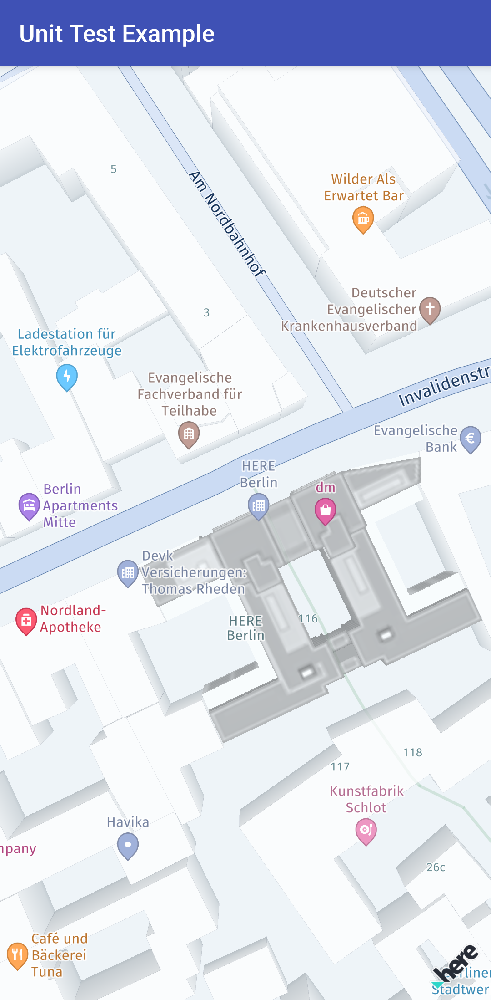

The UnitTestingKotlin example app shows how the HERE SDK can be mocked in unit tests.

Build instructions:
-------------------

1) Copy the AAR file of the HERE SDK for Android to your app's `app/libs` folder.

2) Copy the "heresdk-xxx.jar" mock JAR file of the HERE SDK for Android to your app's `app/libs` folder. This mock library was compiled for Java, but will also support most use cases for Kotlin.

Note: If your AAR/JAR versions are different than the version shown in the _Developer Guide_, you may need to adapt the source code of the example app.

3) Open Android Studio and sync the project.

4) Open file `TestBasicTypes.kt` and run unit tests from it.
