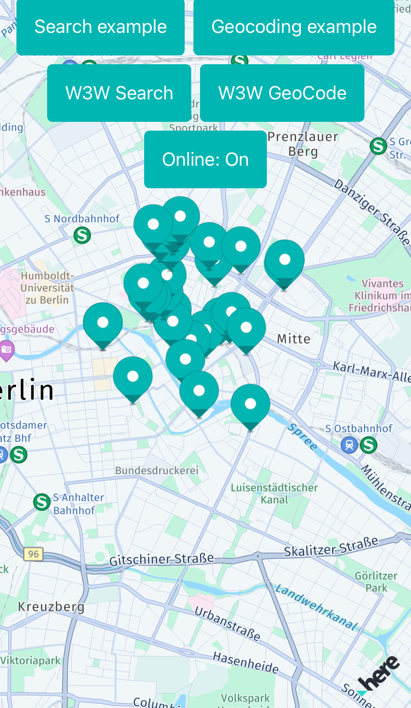

The SearchHybrid example app shows how to search for places including autosuggestions, for the address that belongs to certain geographic coordinates (_reverse geocoding_) and for the geographic coordinates that belong to an address (_geocoding_). You can find how this is done in [SearchHybridExample.swift](SearchHybrid/SearchHybridExample.swift).

Map storage in this app relies only on cache, and offline maps are not loaded. Offline maps could also be implemented here, but offline search is out of scope for this app. To learn how to implement it, see the OfflineMaps example app and [OfflineMapsExample.swift](../OfflineMaps/OfflineMaps/OfflineMapsExample.swift).

Build instructions:
-------------------

1) Copy the `heresdk.xcframework` folder (as found in the HERE SDK package) to your app's root folder.

Note: If your framework version is different than the version shown in the _Developer Guide_, you may need to adapt the source code of the example app.

2) Open Xcode by double-clicking the `*.xcodeproj` file.

Note: In Xcode, open the _General_ settings of the _App target_ and make sure that the HERE SDK framework appears under _Embedded Binaries_. If it does not appear, add the `heresdk.framework` to the _Embedded Binaries_ section ("Add other..." -> "Create folder references").

Please do not forget: To run the app, you need to add your HERE SDK credentials to the `SearchHybridApp.swift` file of your project. More information can be found in the _Get Started_ section of the _Developer Guide_.
